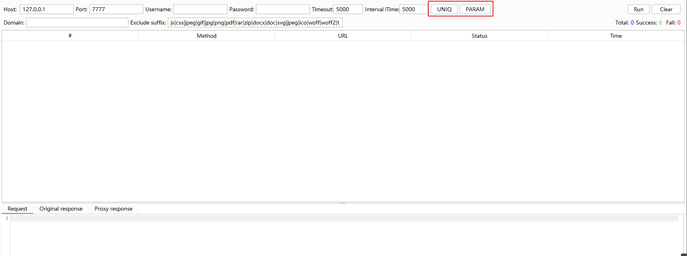

# Passive Scan Client | Burp被动扫描流量转发插件

## 0x01 插件简介

```
Q1: 将浏览器代理到被动扫描器上，访问网站变慢，甚至有时被封ip，这该怎么办？
Q2: 需要人工渗透的同时后台进行被动扫描，到底是代理到burp还是被动扫描器？
Q3: ......
```

该插件正是为了解决该问题，将`正常访问网站的流量`与`提交给被动扫描器的流量`分开，互不影响。


## 0x02 额外功能(本分支)

```
1、支持自定义默认启动配置。
	1、优先从插件所在目录读取psc.config.yml文件
	2、不存在时,从jar包内部读取psc.config.yml文件

2、使用多种算法实现请求去重，不转发相同流量. 
    1、完全相同请求去重
    2、参数相同请求去重
    3、支持忽略无参数请求
    4、支持Json请求体自动解码
```


## 0x03 更新记录(本分支)

##### 顽固问题

```
对于jdk17启动的burpsuite,依旧无法运行本程序，原因未知，请使用jdk8-jdk15
jdk11启动burpsuite 2022.6.1  可以运行PSC
jdk12启动burpsuite 2022.11.1  可以运行PSC
jdk17启动burpsuite 2022.11.1  不可运行PSC

问题详情：https://github.com/c0ny1/passive-scan-client/issues
```


v0.4.10.0  优化域名过滤

```
1、修改Domain为TargetHost，并优化正则匹配过程
//无正则情况全部放行
Pattern pat = Pattern.compile("^.*("+regx+").*$",Pattern.CASE_INSENSITIVE);//正则判断

2、增加BlackHost 窗口,按[后缀]过滤目标
//无正则情况全部放行
Pattern pat = Pattern.compile("^.*("+regx+")$",Pattern.CASE_INSENSITIVE);//正则判断

3、修改ExcludeSuffix为BlackSuffix
//无正则情况全部放行
//无后缀情况全部放行 
Pattern pat = Pattern.compile("^("+regx+")$",Pattern.CASE_INSENSITIVE);//正则判断

4、增加SHOW_DEBUG_MSG标志，控制显示调试信息

5、PSC默认配置文件已修改,外部配置文件需更新
DEFAULT_TARGET_HOST_REGX: ""
DEFAULT_BLACK_HOST_REGX: "bing.com|baidu.com|microsoft.com|msn.com|nelreports.net|azure.com|bdstatic.com"
DEFAULT_BLACK_SUFFIX_REGX: "js|css|jpeg|gif|jpg|png|pdf|rar|zip|docx|doc|svg|jpeg|ico|woff|woff2|ttf|otf"
DEFAULT_SHOW_DEBUG_MSG: false

注意：
1、右键转发到PSC功能可强制 绕过 正则匹配目标功能 扫描。
2、匹配顺序: 白名单域名匹配>>黑名单域名匹配>>黑名单后缀匹配

```


##### v0.4.9.2 支持去重请求数量限制

```
SMART功能通过HASHMAP去重
UNIQ功能通过HASHSET去重
当存在大量不同的请求时,可能会超出内存限制。
解决方法:
1、通过Clear按钮手动清空
2、新增LIMIT配置,当超出指定大小时自动清空(新增功能)

DEFAULT_HASH_MAP_LIMIT: 500
DEFAULT_HASH_SET_LIMIT: 1000

注意：使用自定义启动配置文件的用户需要更新(psc.config.yml)配置文件
```

##### v0.4.9.1 优化SAMRT过滤

```
V0.4.9下只对JSon参数做一层解封处理,对于多级Json参数无法处理.本版本实现Json请求包的递归解析.

三层Json数据格式处理实例：
{"ocid":true,"targetType":true,"user":true,
"inner":{"ocid":true,"targetType":true,"user":true,
"inner":{"ocid":true,"targetType":true,"user":true}}}

被记录的数据:
{"inner.inner.ocid":"1","inner.inner.targetType":"1","inner.inner.user":"1","inner.ocid":"1","inner.targetType":"1","inner.user":"1","ocid":"1","targetType":"1","user":"1"}

按钮优先级:
PARAM >SMART> UNIQ
SMART 和 UNIQUE 两个二选一即可, 多选只是增加计算量.
```

##### v0.4.9 增加SMART按钮

```
通过判断请求的参数是否已经请求过，来进行过滤请求报文转发
示例 如:
请求1 http://www.baidu.com/index.php?a=1&b=2  放行
HashMap记录 http://www.baidu.com/index.php {a:true,b:true}
请求2 http://www.baidu.com/index.php?a=2  过滤
请求3 http://www.baidu.com/index.php?b=2  过滤
请求4 http://www.baidu.com/index.php?c=2  放行
HashMap记录  http://www.baidu.com/index.php {a:true,b:true,c:true}
DEFAULT_SELECTED_SAMRT: false //新增
```


##### v0.4.8.2 扩展默认启动项配置

```
1、可在配置文件配置是否默认启用UNIQ和PARAM按钮
DEFAULT_EXTENSION_NAME: "PSC"
DEFAULT_VERSION: "0.4.8.2"
DEFAULT_PROXY_HOST: "127.0.0.1"
DEFAULT_PROXY_PORT: 7777
DEFAULT_PROXY_USERNAME: ""
DEFAULT_PROXY_PASSWORD: ""
DEFAULT_PROXY_TIMEOUT: 5000
DEFAULT_DOMAIN_REGX: ""
DEFAULT_SUFFIX_REGX: "js|css|jpeg|gif|jpg|png|pdf|rar|zip|docx|doc|svg|jpeg|ico|woff|woff2|ttf|otf"
DEFAULT_INTERVAL_TIME: 5000
DEFAULT_SELECTED_UNIQ: false //新增
DEFAULT_SELECTED_PARAM: false //新增
```

##### v0.4.8.1 优化文件

```
1、清理release文件夹
2、发布release
3、清理测试代码
```

##### v0.4.8 修复BUG

```
1、对于没有成功发送到代理服务器的请求,不计入hashset.
2、修复GetPathExt函数处理Path为[/]时产生的异常.
```

##### v0.4.7 增加自定义默认配置文件功能

```
优先从插件所在目录读取psc.config.yml文件
文件不存在时,从jar包内部读取psc.config.yml文件

DEFAULT_EXTENSION_NAME: "Passive Scan Client" 
DEFAULT_VERSION: "0.4.7"
DEFAULT_PROXY_HOST: "127.0.0.1"
DEFAULT_PROXY_PORT: 7777
DEFAULT_PROXY_USERNAME: ""
DEFAULT_PROXY_PASSWORD: ""
DEFAULT_PROXY_TIMEOUT: 5000
DEFAULT_DOMAIN_REGX: ""
DEFAULT_SUFFIX_REGX: "js|css|jpeg|gif|jpg|png|pdf|rar|zip|docx|doc|svg|jpeg|ico|woff|woff2|ttf|otf"
DEFAULT_INTERVAL_TIME: 5000
```

##### v0.4.6 优化URL后缀匹配规则

```
//无后缀情况全部放行
//正则判断
Pattern pat = Pattern.compile("^("+regx+")$",Pattern.CASE_INSENSITIVE);
获取URL后缀后再进行正则匹配,防止URL路径中存在类似后缀名的目录时产生的误报。
```
##### v0.4.5 无参数请求过滤按钮20221122

```
1、增加PARAM框，支持过滤没有参数的请求，默认关闭。 PS：点击PARAM按钮后，将不会转发没有参数的请求。
```



##### v0.4.4 重复请求过滤按钮 20221122

```
1、修改ReqUinq框为UNIQ按钮，默认关闭。 PS：点击UNIQ按钮后，将不会转发已经转发过的请求。
```

##### v0.4.3 请求去重 20221122

```
1、优化变量名称
2、添加ReqUinq 框，仅当ReqUinq 内容设置为 true 时，对请求基于URL及Body hash进行hash记录。注: 不会记录40X、50X、访问拒绝等响应状态码。 
```

##### v0.4.2 修复新增 20221122

```
1、参考#34 修复代理用户名密码为空时判断BUG.  更新详情: https://github.com/c0ny1/passive-scan-client/pulls.
2、对所有请求基于URL及Body hash进行hash记录，当下一次遇到相同请求时忽略请求报文,  注：点击clear按钮可清空hashset. 
```


##### v0.4.1 合并更新 20221122

```
1、基于c0ny1的passive-scan-client-0.3.0合并更新Pull #27 #21 #22. 更新详情: https://github.com/c0ny1/passive-scan-client/pulls.
```


##### v0.4.0 R4ph4e1-0x01 pull

```
v0.4.0 更新详情: https://github.com/c0ny1/passive-scan-client/pull/27
基于https://github.com/Conanjun/passive-scan-client-and-sendto，增加右键手动转发的菜单，拓展插件的灵活性。
```


##### v0.3.0 原版更新20210728

```
v0.1 支持流量过滤（域名和后缀）
v0.1 支持用户名密码认证代理
v0.3 增加请求转发间隔时间
原Git地址：https://github.com/c0ny1/passive-scan-client/
```

## 0x04 下载编译

```
手动编译： mvn package
发布版本： release
```

## 0x05 插件演示

可以通过插件将流量转发到各种被动式扫描器中，这里我选`xray`来演示.


## 0x06 一些被动式漏洞扫描器

* [GourdScanV2](https://github.com/ysrc/GourdScanV2)  由ysrc出品的基于sqlmapapi的被动式漏洞扫描器
* [xray](https://github.com/chaitin/xray) 由长亭科技出品的一款被动式漏洞扫描器
* [w13scan](https://github.com/boy-hack/w13scan) Passive Security Scanner (被动安全扫描器)
* [Fox-scan](https://github.com/fengxuangit/Fox-scan) 基于sqlmapapi的主动和被动资源发现的漏洞扫描工具
* [SQLiScanner](https://github.com/0xbug/SQLiScanner) 一款基于sqlmapapi和Charles的被动SQL注入漏洞扫描工具
* [sqli-hunter](https://github.com/zt2/sqli-hunter) 基于sqlmapapi，ruby编写的漏洞代理型检测工具
* [passive_scan](https://github.com/netxfly/passive_scan) 基于http代理的web漏洞扫描器的实现

## 0x07 NEED STAR And ISSUE

```
1、右上角点击Star支持更新.
2、ISSUE或NOVASEC提更新需求.
```

